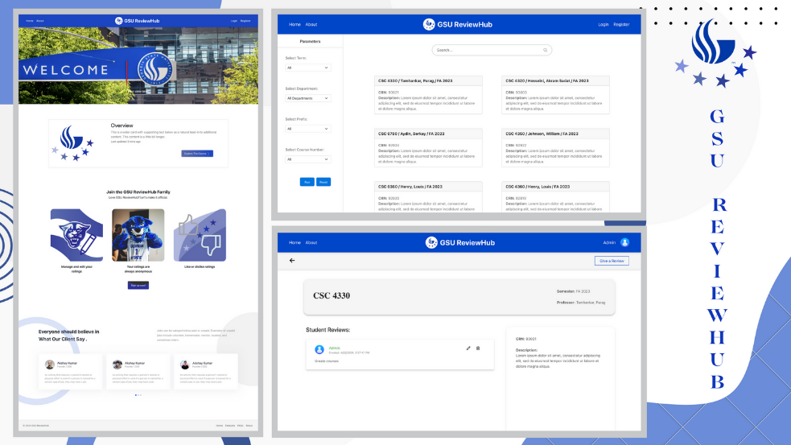

# GSU_ReviewHub
  

## ⭐ Description
* ***[GSU ReviewHub website]*** is an online platform dedicated to simplifying the process of reviewing and discovering courses at Georgia State University. While there are various course review platforms available, GSU ReviewHub stands out for its user- friendly interface and comprehensive features tailored specifically for the GSU student community. My primary aim is to facilitate informed decision-making by providing students with reliable and insightful course reviews, thereby enhancing their academic experience.

## 🌐 Web Screenshots

## ⭐ Features
* Authentication
* Add / Delete / Edit
* Insert Excel data
* Search

## 💻 Tech Stacks
* React JS

*  HTML 

*  CSS

*  Javascript

*  Bootstrap

*  Node JS

*  SQL Database
 
